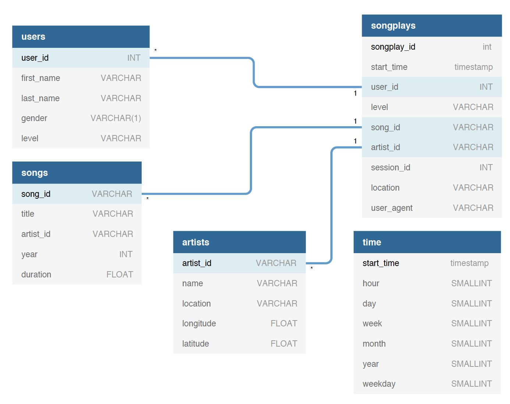

# Purpose
This database can help data analysts at Sparkify in analyzing songs played by users. Origanaly, the data resides on JSON files which are not efficient for querying information. 

# Database Schema
The database is modeled as a start schema where there is only one fact table which is called **songplays** and four dimenstion tables, **users, songs, artists, and time**.

# ETL Pipeline
The ETL pipeline process extracts data from the JSON files and loads it to the Postgres database. It starts by reading all the data in the song JSON files, extract songs and artists data, and then it inserts the songs in the **songs** table and the artists in the **artists** table. After that, it reads all the log files to extract other userful information (e.g. timestamps and users) as well as the loading the **sonplay** table.